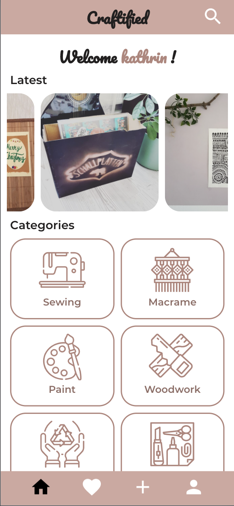
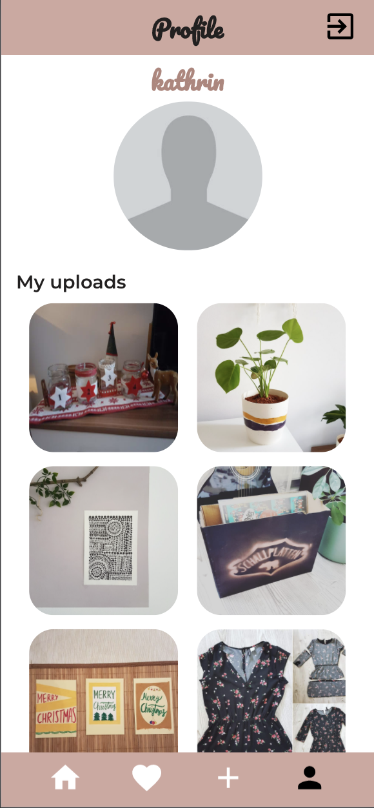
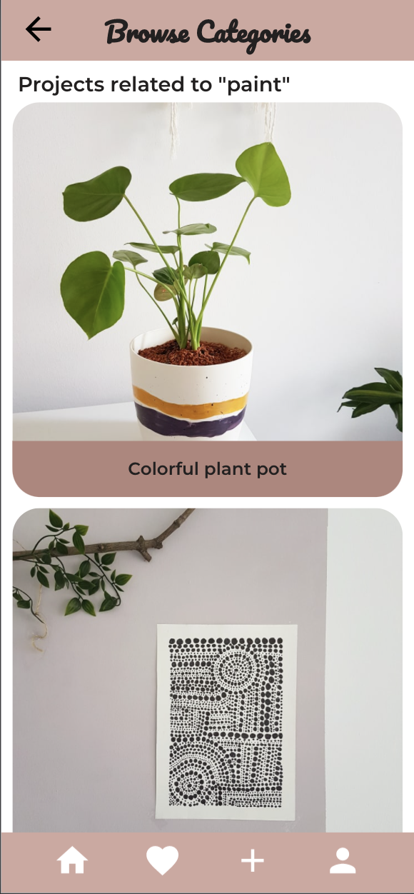

# Craftified

Capstone project from my 3-month bootcamp with Neue Fische.

For all DIY Geeks who seek inspiration for the next project or want to upload their own to share it with the community.

---

Mein digitales Gesellenstück zum Abschluss des dreimonatigen Neue Fische-Bootcamps.

Eine App für alle DIY Geeks und die, die es noch werden wollen. Durchstöbere Projekte oder lade deine eigenen hoch und teile sie mit der Community.

## Deployment

Try out my app on heroku: [Craftified](https://craftified.herokuapp.com/)

## Getting Started

1. Clone or fork the project.
2. Run `npm i`
3. You'll need a MongoDB database and a Cloudinary account. Example .env is included
4. Run `npm run dev` to start the server.

---

 
 
 
